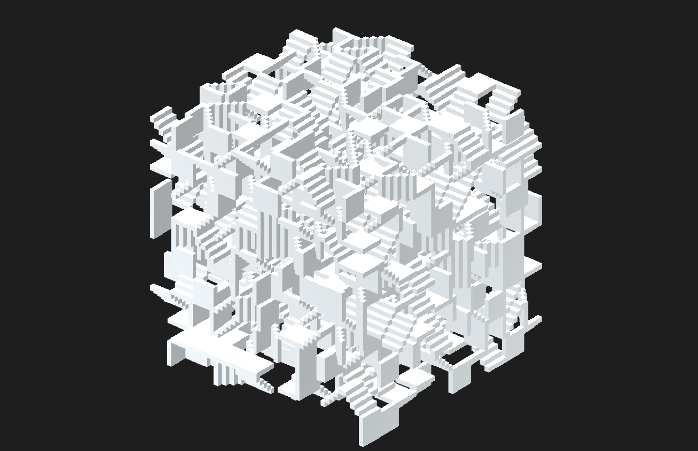

# 3D Maze Generator: Wave Function Collapse in Unity
Implement [wave function collapse](https://github.com/mxgmn/WaveFunctionCollapse) in Unity to procedurally generate 3D maze.

## Get Started
### To Edit
- Recommend Unity version: 2022.3.35f

### To Play
Play 3D Maze Generator online on [itch.io](https://captainceleste.itch.io/3d-maze-generator)

## Acknowledgement
- Tutorials by [Game Dev Garnet](https://www.youtube.com/@GarnetKane) and his open source repo [WaveFunction3D](https://github.com/GarnetKane99/WaveFunction3D)
- Animation tool [DOTween](https://assetstore.unity.com/packages/tools/animation/dotween-hotween-v2-27676?srsltid=AfmBOoqsqfy7Bo16Ayw07Zb94V-wc9TFKMK0-Plv1V7b2MqS7xj4GCgR)

