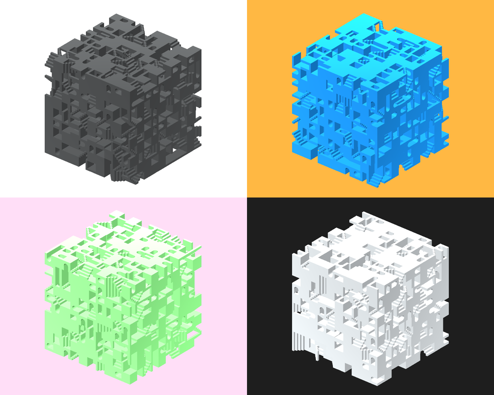

# 3D Maze Generator: Wave Function Collapse in Unity
Implement [wave function collapse](https://github.com/mxgmn/WaveFunctionCollapse) in Unity to procedurally generate 3D maze.

## Acknowledgement
- Tutorials by [Game Dev Garnet](https://www.youtube.com/@GarnetKane) and his open source repo [WaveFunction3D](https://github.com/GarnetKane99/WaveFunction3D)
- [WFCMaze](https://github.com/keijiro/WfcMaze)

